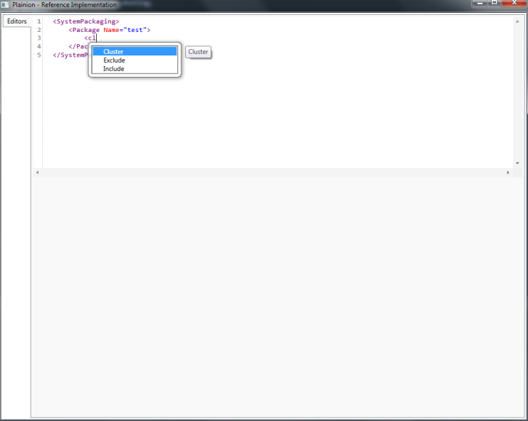

Simple editor controls to support DSLs in WPF applications 

## XmlEditor

An editor for XML based DSLs. Supports

- syntax highlighting
- auto-completion

## Prism.RI

Use the reference implementation (Prism.RI.exe) to play around with the extensions provided by 
this library.

